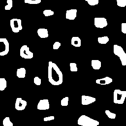
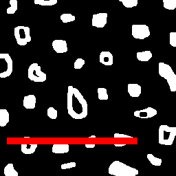

= Albertho S. Costa - Engenheiro de Controle e Automação
E-mail <albertho.costa.091@ufrn.edu.br>

== Processamento Digital de Imagens

=== Processamento de Imagens no Domínio Espacial

Ferramenta que busca alterar uma determinada imagem de entrada, de maneira a deixá-la com aspectos mais realçados, suavizados (borramento), ou aspectos desejados de acordo com o filtro utilizado. Nesse caso, as operações são feitas diretamente no plano da imagem.

==== Exemplos de implementação:

* Arquivo Makefile que possui regras para compilar as dependências das bibliotecas openCV de forma automática.

.. Makefile
[source,Makefile]
.SUFFIXES:
.SUFFIXES: .cpp
GCC = g++
.cpp:
	$(GCC) -Wall -Wunused -std=c++11 -O2 $< -o $@ `pkg-config --cflags --libs opencv4`

* Exemplo 1:  "helloworld" que apresente uma imagem em tons de cinza via terminal, utilizando openCV na linguagem de programação C++.

** Hello.cpp
[source,hello.cpp]
#include <iostream>
#include <opencv2/opencv.hpp>
int main(int argc, char** argv){
  cv::Mat image;
  image = cv::imread(argv[1],cv::IMREAD_GRAYSCALE);
  cv::imshow("image", image);
  cv::waitKey();
  return 0;
}

** Hello.cpp Response:

image::biel.png[]

* Exemplo 2: O programa irá abrir a imagem bolhas.png (interpretando-a em escala de cinza), deverá exibi-la em uma janela e desenhar um quadrado preto em uma região pré-estabelecida.
Após isso, ele irá aguardar que o usuário pressione alguma tecla. Uma vez pressionada a tecla, o programa reabrirá o arquivo da imagem interpretando-a em escala de cores e passará a desenhar um quadrado vermelho na mesma região que foi pré-estabelecida.

[source,pixels.cpp]
#include <iostream>
#include <opencv2/opencv.hpp>
int main(int, char**){
  cv::Mat image;
  cv::Vec3b val;
  image= cv::imread("bolhas.png",cv::IMREAD_GRAYSCALE);
  if(!image.data)
    std::cout << "nao abriu bolhas.png" << std::endl;
  cv::namedWindow("janela", cv::WINDOW_AUTOSIZE);
  for(int i=200;i<210;i++){
    for(int j=10;j<200;j++){
      image.at<uchar>(i,j)=0;
    }
  }
  cv::imshow("janela", image);  
  cv::waitKey();
  image= cv::imread("bolhas.png",cv::IMREAD_COLOR);
  val[0] = 0;   //B
  val[1] = 0;   //G
  val[2] = 255; //R
  for(int i=200;i<210;i++){
    for(int j=10;j<200;j++){
      image.at<cv::Vec3b>(i,j)=val;
    }
  }
  cv::imshow("janela", image);  
  cv::waitKey();
  return 0;
}

** pixels.cpp Input:

** pixels.cpp Response:

* Exemplo 3: O programa solicita ao usuário as coordenadas de dois pontos P1 e P2 localizados dentro dos limites do tamanho da imagem que lhe for fornecida. Entretanto, a região definida pelo retângulo de vértices opostos definidos pelos pontos P1 e P2 será exibida com o negativo da imagem na região correspondente.

[source,ruby]
std::cout << "Meu primeiro teste!";
